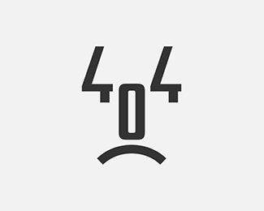

# Kickoff Meeting
## Team #7
## Team name: 404
### Date: 4/18/23, Time: 3-5pm, Location: Catalyst, Sixth College

Scribe: Mary Vu

**Full Attendance**

In-person attendees:
- Mary
- Nishant
- Matthew
- Ada
- Steven
- Raj

Zoom attendees:
- Ankit
- Anukul
- Eddie

## Agenda:
- [x] Branding
- [] Group Contract
- [] Video
- [] Team Page
- [] Scheduling Team Bonding and in-general
- [] Discuss 8-Ball Project

## Branding

To decide on a name, we decided to have everyone give a name suggestion and/or vote for (a) name(s). We all agreed on 404 being our team name.

Team name suggestions:
- Ankit: Nibble (2nd: Anukul, 3rd: Raj, 4th: Steven)
- Matthew: The Destroyers (2nd: Ada)
- Nishant: Heat Dodgers
- Eddie: 404 (2nd: Mary, 3rd: Matthew, 4th: Ankit, 5th: Anukul, 6: Nishant)

Team colors suggestion:
- Mary: Greens i.e. Matcha green, sage green, light green, forest green, brown
- Steven: Purple i.e. lavendar (Nishant)
- Ada: Cyan

Finalized Team Colors we all agreed on:
Forest Green, lavendar, cyan

After searching google for team poster inspiration, we decided on this image that Ankit found below:

